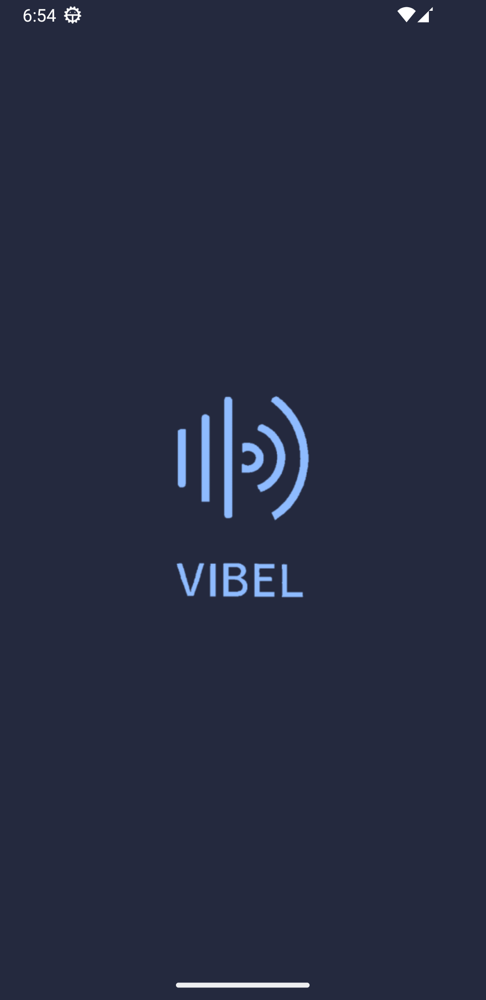
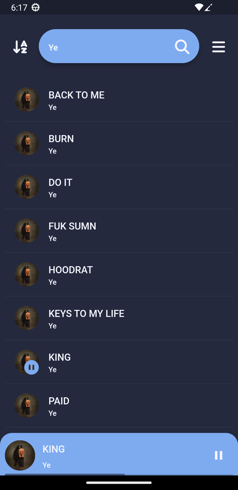
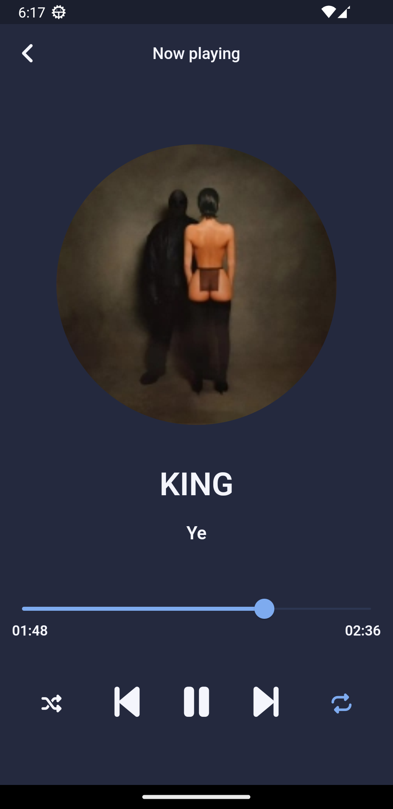

### Welcome to Vibel 🎵

Vibel is a lightweight and simple music listening app developed using Flutter. It's designed for enjoying your local music collection right on your device. 📱🎶

#### Features 🌟

-   **Looping Modes**: Enjoy your favorite tracks on repeat with different looping options.
-   **Shuffle**: Mix it up and shuffle your playlist for a fresh listening experience.
-   **Search**: Easily find songs by title or artist, making navigation a breeze.
-   **Language Selection**: Choose your preferred language for the app's interface.
-   **Theme Customization**: Personalize your experience with light or dark themes.

#### Dependencies 📦

-   just_audio: A Flutter plugin for playing audio from streams, files, or assets.
-   just_audio_background: Background audio playback for Flutter apps.
-   on_audio_query: A Flutter plugin for querying information about audio files.
  
#### Screenshots 📷

#### Contributions 🤝

Contributions are welcome! If you have suggestions, bug reports, or feature requests, please open an issue or submit a pull request.

Enjoy your music with Vibel! 🎧✨
